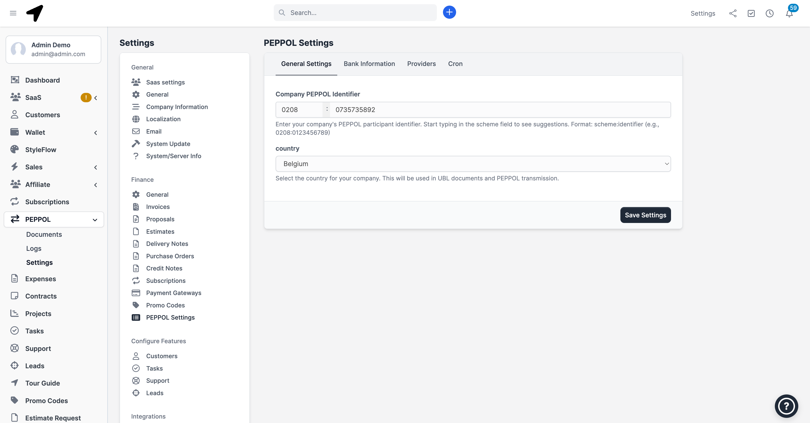
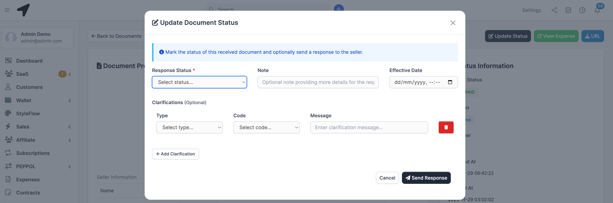
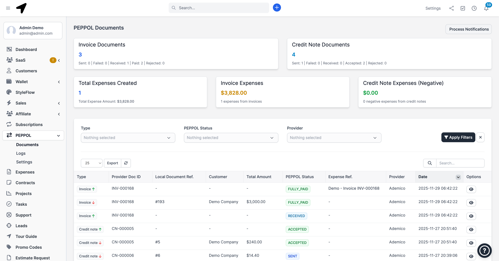

# Configuration

The module can be configured in Finance tab of the Perfex CRM Settings

Navigate to Settings > Finance > Delivery Notes (tab) and provide your settings like prefix, number format e.t.c

From the settings page, you can control the hidden items field, by default only Quantity is shown on delivery note base on common practices. You can edit the hidden items field to exclude other info i.e amount, tax and rate. Select the empty option to empty the list.

On the PDF, the signatory information include by default Signatory name, date and IP. You can also control fields that will be shown from the Delivery note settings tab. Select the empty option to empty the list.

## Company Signature on PDF

Navigate to Settings > PDF > Signature (tab) to disable or enable company signature on delivery note PDF's

## Client Identify confirmation (signature) on Delivery

Navigate to Settings > E-Sign to disable or enable identity confirmation by client on delivery. This give the client an avene to confirm the delivery.

## Email Templates

Quite numbers of email are sent through the module. Naviagte to Setups > Email Templates and scroll to the bottom to see list of the email templates used within the module. Edit, disable/enable as neeccessary.

