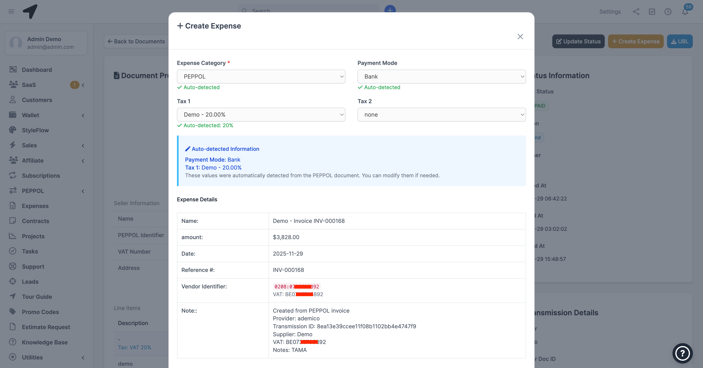
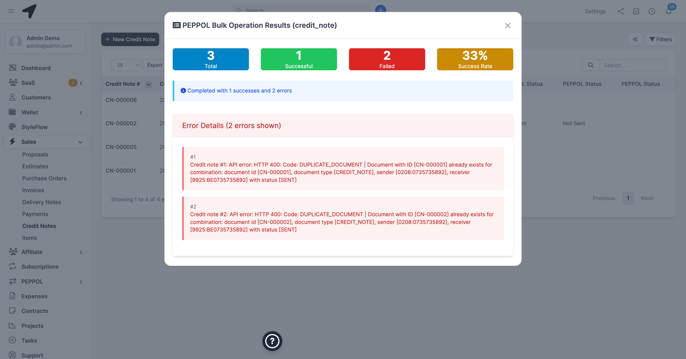
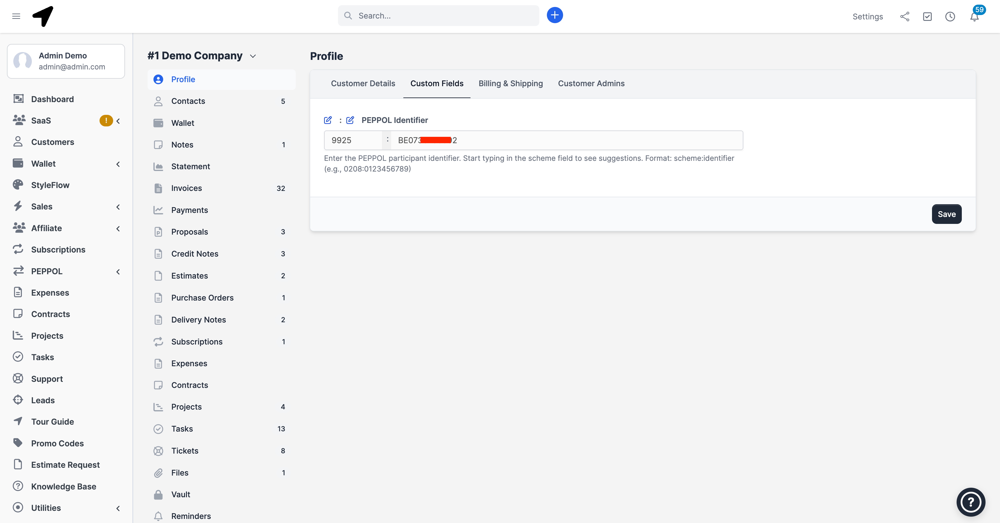
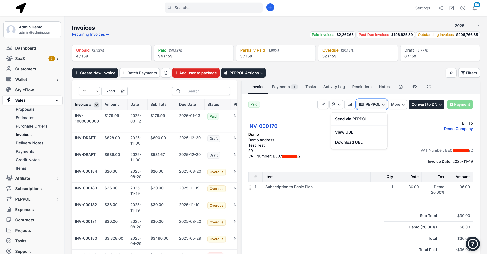
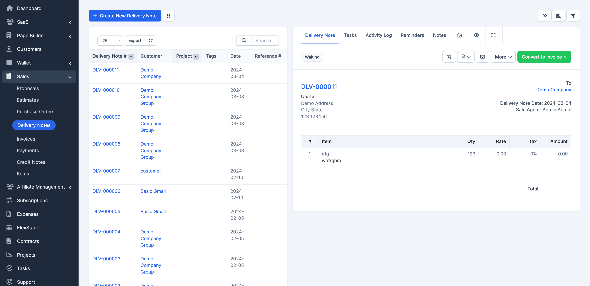

# Usage

After activation and configuring the module, you can see Delivery Notes menu in Sales menu on the main side bar where you can manage the whole delivery notes on the system.

Delivery note menu is also added to customer profile tabs where you can easily manage DLV for a particular customer.

Each project related delivery notes are easily accessible from the project Sales tab.

Multi signatory feature allowing multiple staff (department) appending signature to the same delivery note.

Control delivery notes items table column visibility in tables and PDFs.

Support for custom fields - You can extend delivery notes content and items with custom fields.

## Signatory

Multiple staff signatory allow multiple deparment signing a delivery note. Customer can also sign delivery note to confirm delivery. Delivery note is automatically marked as delivered when signed by the client.

By default, company and client signatory are also add to the delivery note along staff signatures. You can disable the company or client signatory from the settings area.

See the configuration section for managing common signatory i.e (company and client)

## Creating and Conversion

-   Delivery note can be created from an estimate i.e you can convert an estimate to a delivery note
-   Delivery note can also be created from a purchase order (when the purchase order module is installed)
-   A delivery note may be created from an invoice.
-   A delivery note may be converted to an invoice.

**Note: an estimate might only be converted to either an invoice or a delivery note.**

