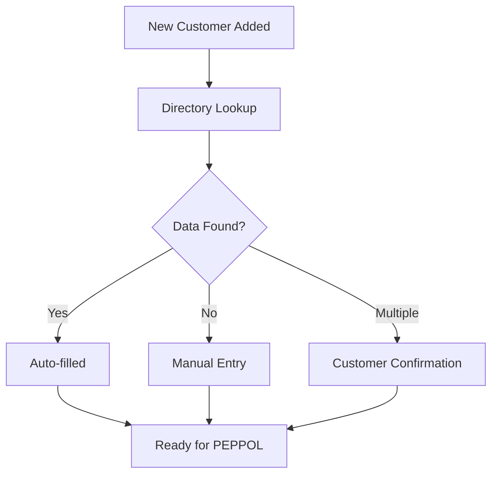

# Managing the PEPPOL Directory

This guide walks you through using the PEPPOL Directory feature to manage customer participant information.

## Getting Started

### Prerequisites

- Administrative access to Perfex CRM
- PEPPOL module installed and configured
- At least one customer in your CRM system

### Accessing the Directory

1. Log into your Perfex CRM admin panel
2. Navigate to **PEPPOL** in the main menu
3. Click **Directory** from the submenu
4. You'll see the directory page with all customers listed

## Understanding the Directory Interface

### Main Elements

The directory page contains several key components:

#### Header Section
- **Page Title**: "Peppol Directory"
- **Auto Lookup Button**: Blue button for batch processing
- **Info Panel**: Helpful description of the feature

#### Customer Table
- **Search Box**: Real-time search across all customer data
- **Column Headers**: Click to sort by any column
- **Pagination Controls**: Navigate through multiple pages
- **Per-page Options**: Choose how many customers to display

#### Individual Controls
- **Customer Links**: Click company names to view customer profiles
- **Lookup Buttons**: Individual lookup action for each customer

## Performing Directory Lookups

### Batch Auto Lookup

The batch lookup feature processes multiple customers at once:

1. **Initiate Batch Lookup**
   - Click the **"Auto Lookup"** button in the header
   - A modal dialog will appear

2. **Choose Processing Option**
   - **Option A - All Customers**: Select "All customers" to process everyone
   - **Option B - Selected Customers**: Choose "Select customers" to pick specific ones

3. **Start Processing**
   - Click **"Start Lookup"** to begin
   - Watch the progress indicator update in real-time
   - See detailed status messages as each customer is processed

4. **Review Results**
   - View the summary when processing completes:
     - **Successfully Updated**: Number of customers with data found
     - **Failed**: Number of customers with no data found
     - **Multiple Results**: Number requiring manual review

### Individual Customer Lookup

For single customer processing:

1. **Locate the Customer**
   - Use the search box to find specific customers
   - Or browse through the paginated list

2. **Perform Lookup**
   - Click the lookup button (🔍) in the Options column
   - The button will show a spinner during processing

3. **View Results**
   - Success: A popup shows the found PEPPOL information
   - Failure: An error message explains what went wrong
   - The table automatically refreshes with new data

## Working with Search Results

### Successful Lookups

When a lookup succeeds, you'll see:

- **Success Message**: Popup with participant details
- **Updated Table**: Immediate refresh showing new data
- **Visual Indicators**: 
  - Scheme appears as a blue label
  - Identifier appears as formatted code
  - Previously empty fields now contain data

### Failed Lookups

Common reasons for lookup failures:

| Reason | Explanation | Next Steps |
|--------|-------------|------------|
| **No VAT Number** | Customer has no VAT number on file | Add VAT number to customer record |
| **Not in Directory** | Company not registered with PEPPOL | Contact customer about PEPPOL registration |
| **Incorrect Data** | Company name or VAT doesn't match directory | Verify customer information accuracy |

### Multiple Results

Sometimes the directory search returns multiple matches:

1. **Review Options**: Multiple companies may share similar names
2. **Manual Selection**: Contact the customer to confirm correct identifier
3. **Update Manually**: Add the correct PEPPOL data to the customer record

## Using the Search and Filter Features

### Real-time Search

The search functionality helps you quickly find customers:

- **Company Names**: Search by full or partial company names
- **VAT Numbers**: Find customers by their VAT registration
- **PEPPOL Data**: Search existing scheme or identifier values
- **Mixed Searches**: Combine different search terms

### Sorting Options

Click any column header to sort:

- **Company**: Alphabetical order by company name
- **VAT Number**: Numerical/alphabetical order
- **Peppol Scheme**: Group by scheme types
- **Peppol Identifier**: Numerical order
- **Status**: Group active/inactive customers

### Pagination Controls

Navigate large customer lists efficiently:

- **Page Numbers**: Jump to specific pages
- **Previous/Next**: Step through pages sequentially
- **Items per Page**: Display 10, 25, 50, or 100 customers per page
- **Total Count**: See how many customers match your current filter

## Best Practices

### Data Quality Management

1. **Regular Reviews**
   - Schedule monthly directory reviews
   - Check for new customers without PEPPOL data
   - Verify existing data accuracy

2. **Customer Communication**
   - Inform customers when you add their PEPPOL data
   - Ask customers to provide PEPPOL identifiers when registering
   - Include PEPPOL information in customer onboarding

3. **Process Documentation**
   - Train staff on directory lookup procedures
   - Create workflows for new customer setup
   - Establish data verification processes

### Workflow Optimization

#### New Customer Onboarding

#### Regular Maintenance

1. **Weekly**: Check for new customers without PEPPOL data
2. **Monthly**: Run batch lookup for all customers
3. **Quarterly**: Verify and update existing PEPPOL information
4. **Annually**: Review and clean up inactive customer data

## Advanced Features

### Bulk Operations

For power users managing large customer databases:

1. **Filtered Lookups**
   - Search for customers without PEPPOL data
   - Process only active customers
   - Target specific customer segments

2. **Progress Monitoring**
   - Watch real-time processing updates
   - Identify problematic customers immediately
   - Track completion statistics

### Integration with Other Features

The directory integrates seamlessly with:

- **Document Sending**: PEPPOL data enables automatic document delivery
- **Customer Management**: Links directly to customer profiles
- **Expense Creation**: Supports automated expense workflows
- **Reporting**: Provides data for PEPPOL adoption reports

## Troubleshooting Common Issues

### Performance Problems

If the directory loads slowly:

1. **Check Internet Connection**: Slow API responses affect performance
2. **Reduce Page Size**: Display fewer customers per page
3. **Clear Browser Cache**: Refresh cached data
4. **Contact Support**: Report persistent performance issues

### Data Inconsistencies

When customer data doesn't match directory results:

1. **Verify Customer Information**
   - Check VAT number accuracy
   - Confirm company name spelling
   - Validate business registration details

2. **Update Customer Records**
   - Correct any data entry errors
   - Add missing VAT numbers
   - Update company name variations

3. **Manual Override**
   - Add PEPPOL data manually when auto-lookup fails
   - Document the source of manual entries
   - Schedule periodic verification

### Error Recovery

If lookups consistently fail:

1. **Check System Status**
   - Verify PEPPOL module configuration
   - Test internet connectivity
   - Review system logs for errors

2. **API Troubleshooting**
   - Confirm directory service availability
   - Check for API rate limiting
   - Verify request formatting

3. **Contact Support**
   - Provide specific error messages
   - Include customer information that failed
   - Share system configuration details

## Security Considerations

### Data Protection

- **API Security**: All directory requests use secure HTTPS connections
- **Data Privacy**: Only publicly available PEPPOL data is retrieved
- **Access Control**: Directory access requires proper user permissions
- **Audit Trail**: All lookup activities are logged for compliance

### Compliance

The directory feature supports compliance requirements:

- **GDPR**: Only retrieves publicly registered business information
- **Data Accuracy**: Provides tools for maintaining accurate customer data
- **Audit Support**: Comprehensive logging of all directory operations
- **Access Control**: Role-based permissions for directory management